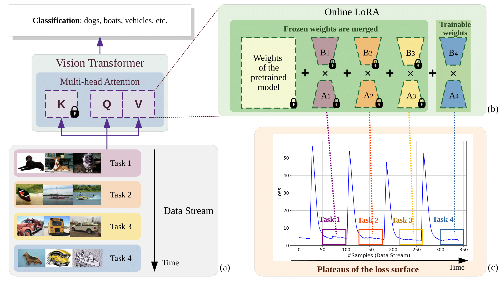

# Online-LoRA
[WACV 2025] Official implementation of "Online-LoRA: Task-free Online Continual Learning via Low Rank Adaptation" by Xiwen Wei, Guihong Li and Radu Marculescu. 

[](https://arxiv.org/abs/2411.05663)

## Abstract

Catastrophic forgetting is a significant challenge in online continual learning (OCL), especially for non-stationary data streams that do not have well-defined task boundaries. This challenge is exacerbated by the memory constraints and privacy concerns inherent in rehearsal buffers. To tackle catastrophic forgetting, in this paper, we introduce Online-LoRA, a novel framework for task-free OCL. Online-LoRA allows to finetune pre-trained Vision Transformer (ViT) models in real-time to address the limitations of rehearsal buffers and leverage pre-trained models' performance benefits. As the main contribution, our approach features a novel online weight regularization strategy to identify and consolidate important model parameters. Moreover, Online-LoRA leverages the training dynamics of loss values to enable the automatic recognition of the data distribution shifts. Extensive experiments across many task-free OCL scenarios and benchmark datasets (including CIFAR-100, ImageNet-R, ImageNet-S, CUB-200 and CORe50) demonstrate that Online-LoRA can be robustly adapted to various ViT architectures, while achieving better performance compared to SOTA methods. 



## Environment

- Python 3.9
- CUDA 11.8

``` bash
conda create -n online_lora python=3.9
conda activate online_lora
pip install torch==2.2.0 torchvision==0.17.0 torchaudio==2.2.0 --index-url https://download.pytorch.org/whl/cu118
pip install timm scipy matplotlib pandas randaugment torch_optimizer
```

## Data Preparation

1. Create a folder named `local_datasets` in the main directory.
2. If you are using the CoRE50 dataset, download the 128x128 version from http://bias.csr.unibo.it/maltoni/download/core50/core50_128x128.zip. Otherwise, the data will automatically download to the `local_datasets` folder when you run the code. 

## Experiment

### Disjoint Class-Incremental Setting

Go to sub-directory `Disjoint`. 

```bash
python -m torch.distributed.launch \
        --nproc_per_node=1 \
        --use_env main.py \
        $config_name \
        --model $model_name \
        --batch-size $batch_size \
        --MAS-weight $mas \
        --lr $lr \
        --loss-window-variance-threshold $var \
        --loss-window-mean-threshold $mean \
        --data-path ./local_datasets \
        --num_tasks $num_task \
        --output_dir $output_dir
```

| Variable | Comments | Instances |
| ---- | ---- | ---- |
| `$config_name` | dataset name | `cifar100_online_lora`, `core50_online_lora`, `imagenetR_online_lora`, `sketch_online_lora`, `cub200_online_lora` |
| `$model_name` | model name | `vit_base_patch16_224`, `vit_small_patch16_224` |
| `$batch_size` | data batch size | default=64 |
| `$mas` | regularization parameter $\lambda$ | default=2000 |
| `$lr` | learning rate | vary with model, see paper appendix for details. |
| `$var` | threshold of loss window variance | See paper appendix B for details. |
| `$mean` | threshold of loss window mean | See paper appendix B for details. |
| `$num_task` | number of CL tasks | 5, 10, 20 |
| `$output_dir` | directory to store output | `./output` |

#### Example: Split-ImageNet-Sketch with 20 tasks

```bash
python -m torch.distributed.launch \
        --nproc_per_node=1 \
        --use_env main.py \
        sketch_online_lora \
        --model vit_base_patch16_224 \
        --batch-size 64 \
        --nb-batch 1 \
        --MAS-weight 2000 \
        --lr 0.0002 \
        --num_tasks 20 \
        --loss-window-variance-threshold 0.08 \
        --loss-window-mean-threshold 5.6 \
        --data-path ./local_datasets \
        --output_dir ./output \
```

### SI-blurry Class-Incremental Setting

(This section uses the settings from [Si-Blurry repo](https://github.com/KHU-AGI/Si-Blurry.git). Please refer to their documentation for details.)

Go to sub-directory `Si-blurry`. 

```bash
python main.py --mode $MODE \
    --dataset $DATASET \
    --n_tasks $N_TASKS --m $M --n $N \
    --rnd_seed $seed \
    --model_name $MODEL_NAME --opt_name $OPT_NAME --sched_name $SCHED_NAME \
    --lr $LR --batchsize $BATCHSIZE \
    --loss-window-mean-threshold $MEAN --loss-window-variance-threshold $VARIANCE \
    --memory_size $MEM_SIZE $GPU_TRANSFORM --transforms --online_iter $ONLINE_ITER --data_dir $DATA_DIR \
    --note $NOTE --eval_period $EVAL_PERIOD --n_worker 4 --rnd_NM
```

| Variable | Comments | Instances |
| ---- | ---- | ---- |
| `$MODE` | name of method | `olora`, `mvp`, `er` |
| `$DATASET` | name of dataset | `cifar100`, `imagenet-r` |
| `N_TASKS` | number of tasks | 5 |
| `M`, `N` | ratio of disjoint and blurry class | `N`=50, `M`=10 |
| `$MODEL_NAME` | name of model | `olora`, `mvp`, `l2p` |
| `$LR` | learning rate | default=2e-4 |
| `$BATCHSIZE` | batch size of data | default=64 |
| `$MEAN` | threshold of loss window variance | default=5.2 |
| `$VARIANCE` | threshold of loss window mean | default=0.02 |
| `$MEM_SIZE` | size of memory buffer | default=0 |
| `$ONLINE_ITER` | number of iteration | default=1 |
| `$DATA_DIR` | path to dataset | `./local_datasets` |

### Domain-incremental Setting

Go to sub-directory `Disjoint`. 

```bash
python -m torch.distributed.launch \
        --nproc_per_node=1 \
        --use_env main.py \
        core50_online_lora \
        --model $model_name \
        --batch-size $batch_size \
        --lr $lr \
        --data-path ./local_datasets \
        --output_dir ./output 
```

| Variable | Comments | Instances |
| ---- | ---- | ---- |
| `$config_name` | For DIL setting, we support CORe50 dataset. | `core50_online_lora` |
| `$model_name` | model name | `vit_base_patch16_224`, `vit_small_patch16_224` |
| `$batch_size` | data batch size | default=64 |
| `$lr` | learning rate | 2e-4 for `vit_base_patch16_224`, 5e-4 for `vit_small_patch16_224` |
| `$output_dir` | directory to store output | `./output` |

## Reference
If our code and paper help you, please kindly cite:
```
@inproceedings{wei2025online,
  title={Online-lora: Task-free online continual learning via low rank adaptation},
  author={Wei, Xiwen and Li, Guihong and Marculescu, Radu},
  booktitle={2025 IEEE/CVF Winter Conference on Applications of Computer Vision (WACV)},
  pages={6634--6645},
  year={2025},
  organization={IEEE}
}
```

## Acknowledgement

Our implementation is based on [Si-Blurry
](https://github.com/KHU-AGI/Si-Blurry.git), [MeLo](https://github.com/JamesQFreeman/LoRA-ViT.git), and [l2p-pytorch](https://github.com/JH-LEE-KR/l2p-pytorch.git). We highly appreciate their contributions to this community.